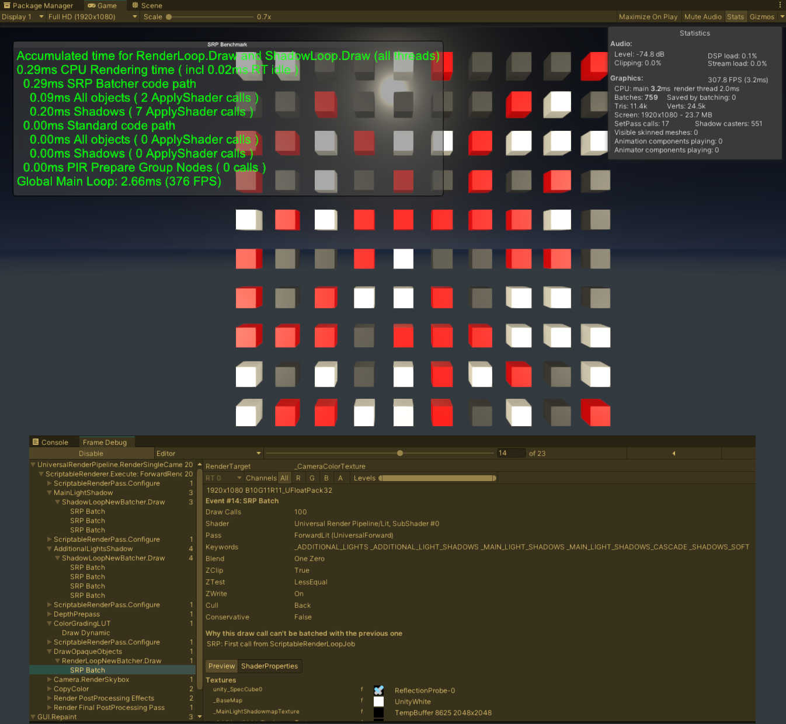

## Synopsis

Unity 2020.2.1f URP Benchmarking with the SRP Batcher using different shaders, materials and textures. 
Please try using different materials with the same base shader and let the SRP Batcher to optimize the process.
Benchmark the SRP Batcher by spawning 100 or more prefabs in a grid with different Point Lights.
Investigate how batching is happening by using Frame Debugger, and step into the batches to see how efficient they are.
You can compare the SRP Batcher, Dynamic Batching and the good old GPU Instancing, and see which one is better for your use case.
Imo, SRP batcher is better when using additional 4+ Real-Time lights with a Real-Time Directional Light in the scene. 
GPU Instancing doesn't scale well with more shadows from additional lights. 

## Packages and Assets

URP-10.2.2 

## Motivation

This sample game project consists of free URP example scene Assets. You may use and extend it in anyway you like. The main purpose of this repo, is to share what I know about URP SRP Batcher and to give back to the community. 

## Examples

## License

MIT License

Copyright (c) 2021 Jon Zorlu

Permission is hereby granted, free of charge, to any person obtaining a copy
of this software and associated documentation files (the "Software"), to deal
in the Software without restriction, including without limitation the rights
to use, copy, modify, merge, publish, distribute, sublicense, and/or sell
copies of the Software, and to permit persons to whom the Software is
furnished to do so, subject to the following conditions:

The above copyright notice and this permission notice shall be included in all
copies or substantial portions of the Software.

THE SOFTWARE IS PROVIDED "AS IS", WITHOUT WARRANTY OF ANY KIND, EXPRESS OR
IMPLIED, INCLUDING BUT NOT LIMITED TO THE WARRANTIES OF MERCHANTABILITY,
FITNESS FOR A PARTICULAR PURPOSE AND NONINFRINGEMENT. IN NO EVENT SHALL THE
AUTHORS OR COPYRIGHT HOLDERS BE LIABLE FOR ANY CLAIM, DAMAGES OR OTHER
LIABILITY, WHETHER IN AN ACTION OF CONTRACT, TORT OR OTHERWISE, ARISING FROM,
OUT OF OR IN CONNECTION WITH THE SOFTWARE OR THE USE OR OTHER DEALINGS IN THE
SOFTWARE.